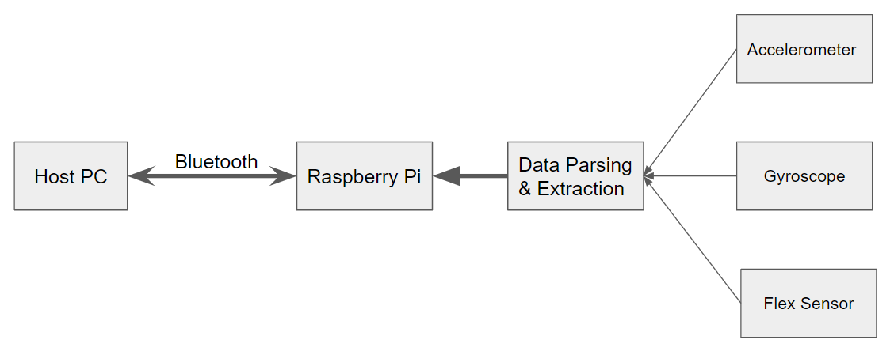

# Motion Control Smart Glove
A smart glove that can control computer interface. Powered by a Raspberry Pi 4, the glove recognizes human hand gestures to control laptop interface such as scrolling up/down, back to home or changing windows.

Components: Raspberry Pi 4, flex sensors, triple-axis accelerometer and gyroscope, MCP 3008, portable power bank, glove, wires

## Design:
<h3 align="center">Hardware</h3>

  

 
<h3 align="center">Software</h3>

  

## Prototypes: 

   

## Video Demo 
Please check final_demo.mp4
